# Cooking Assistant Mobile App

## Introduction
Cooking Assistant Mobile App is a modern Android application developed in **Kotlin** using **Jetpack Compose**. It serves as the frontend for the [Cooking Assistant API](https://github.com/CookingAssistantMobile-org/CookingAssistantAPI), providing users with an intuitive interface for managing recipes and interacting with the community.

The app follows the **MVVM (Model-View-ViewModel)** architecture, ensuring clean code organization and scalability. It supports user registration and authentication via JSON Web Tokens (JWT) and integrates seamlessly with the backend API using **Retrofit**.

---
## Authors
- [filip-wojc](https://github.com/filip-wojc)
- [DarknessoPirate](https://github.com/DarknessoPirate)
- [HAScrashed](https://github.com/HAScrashed)
- [Robert Pintera](https://github.com/RobertPintera)

---
## Features
- **User Authentication**: Secure registration and login using JWT tokens.
- **User Profiles**: Manage profile information, change passwords, upload profile pictures, and delete accounts.
- **Recipe Management**: Add, edit, and delete recipes directly from the app.
- **Favorites and Ratings**: Rate recipes and add them to favorites for easy access.
- **Community Features**: Write and view reviews for recipes.
- **Image Uploads**: Upload and display recipe and profile images.
- **Sorting and Filtering**: Recipes can be filtered by category, difficulty, and occasion, and sorted by ratings, preparation time, review count, and caloricity.
- **Search Functionality**: Search for recipes by name, ingredients, or description.
- **Pagination Support**: Browse large lists of recipes efficiently with pagination.
- **PDF Generation**: Generate PDF versions of recipes for offline use.
- **Validation**: Real-time input validation for user-friendly forms.
- **Responsive Design**: A clean and responsive interface optimized for mobile devices.
- **Voice recognition**: Voice recognition for searching,
- **Shopping list**: Creating local shopping list.
- **Timer**: Timer with notification 

---
## Technologies Used
- **Kotlin** - Programming language
- **Jetpack Compose** - Modern UI toolkit for Android development
- **Retrofit** - HTTP client for network communication
- **Coroutines** - Asynchronous programming
- **Gson** - JSON serialization and deserialization
- **Coil** - Image loading library
- **ViewModel and LiveData** - For state management in the MVVM architecture

---
## Screenshots
- **Login Screen**
  
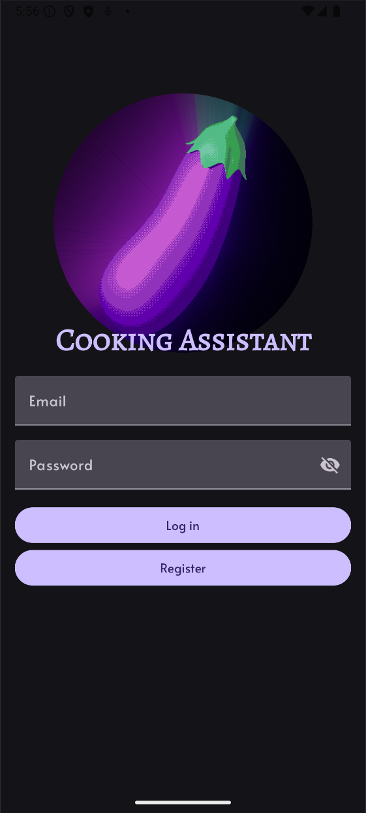
- **Register Screen**
  
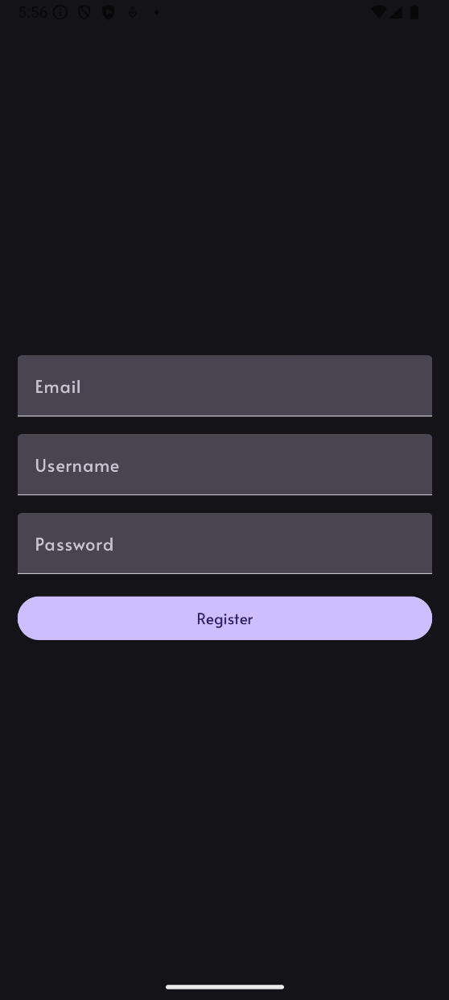
- **Home Screen**
  
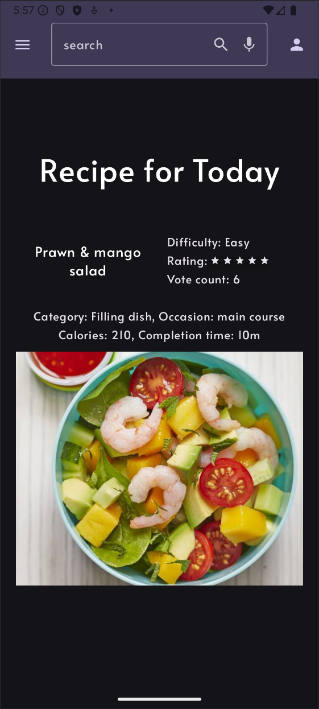
- **Shopping List Screen**
  
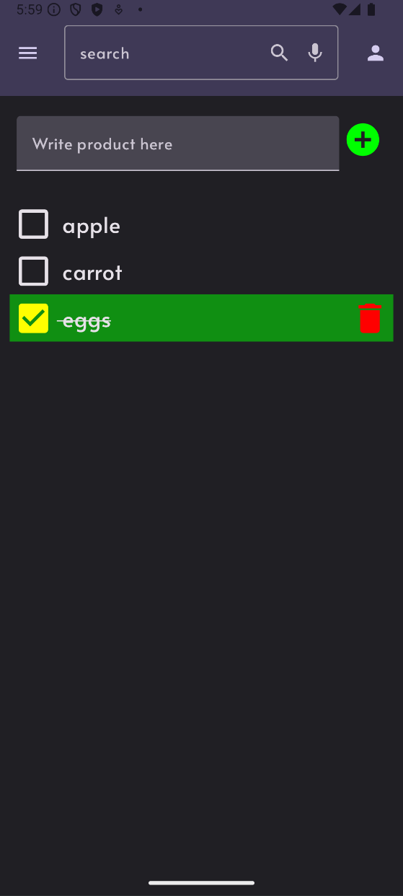
- **Timer Screen**
  
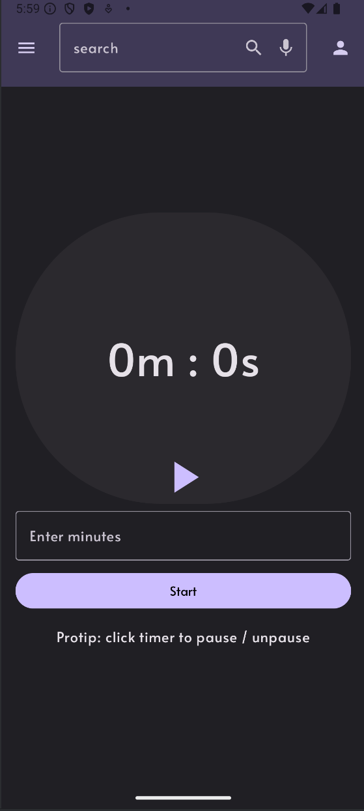
- **Seraching Screen**
  
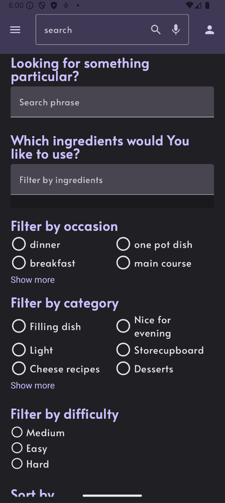
- **Adding Recipe Screen 1**
  
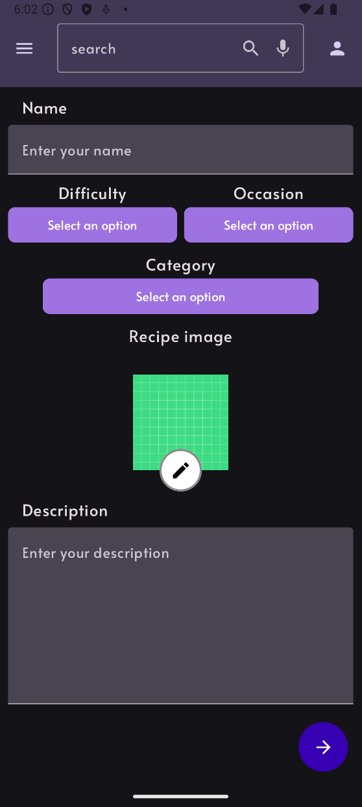
- **Adding Recipe Screen 2**
  
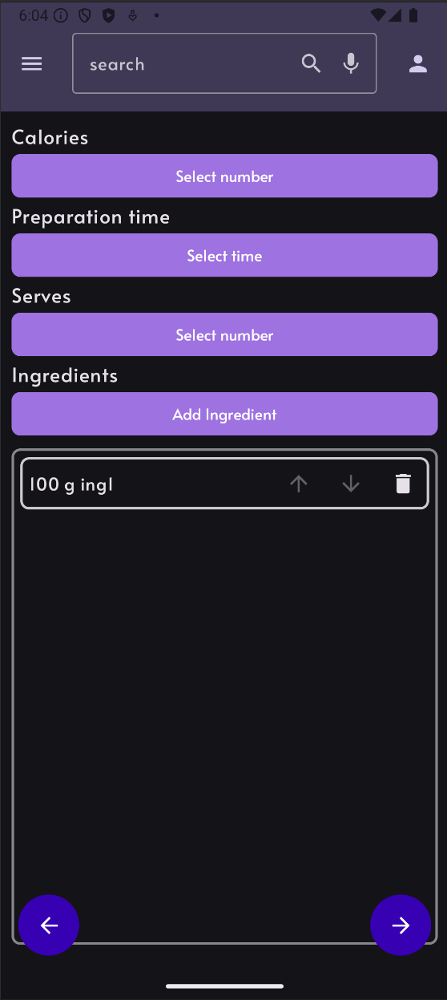
- **Adding Recipe Screen 3**
  
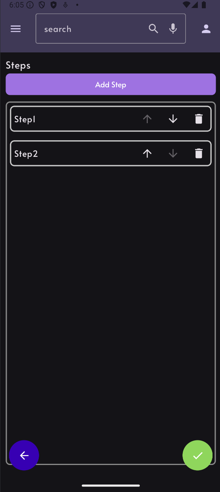
- **Profile Screen**
  
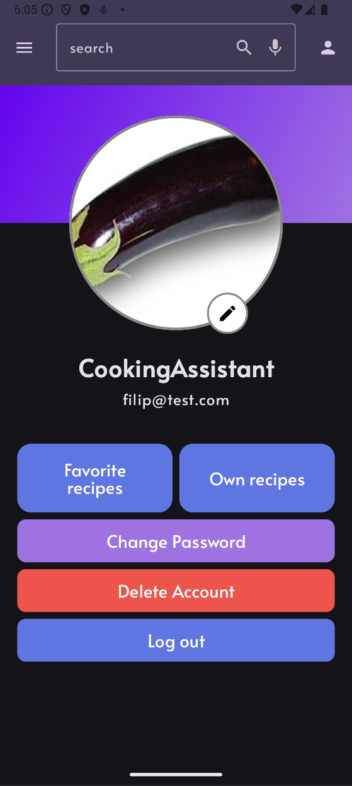
- **Recipe List Screen**

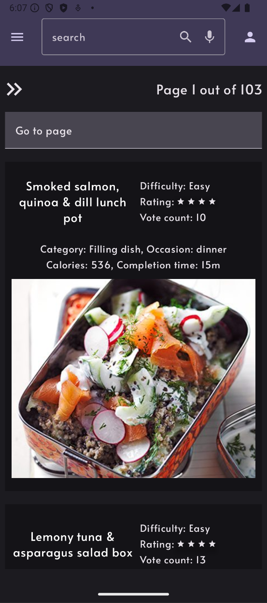
- **Recipe Details Screen (only front page, rest is available in app)**
  
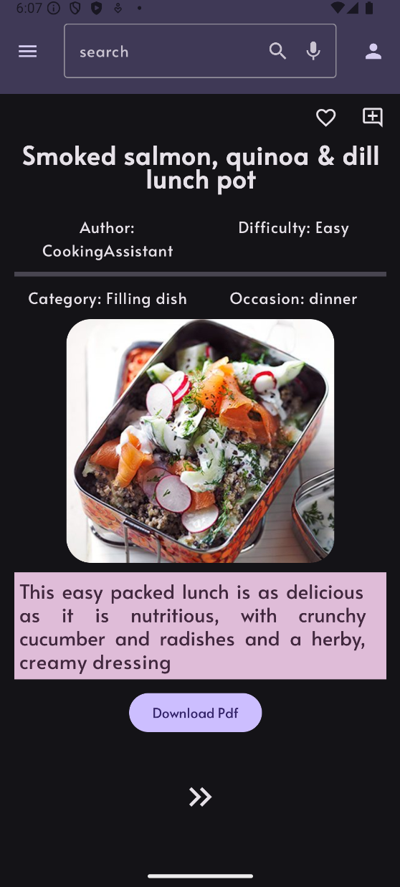
- **Review Screen**

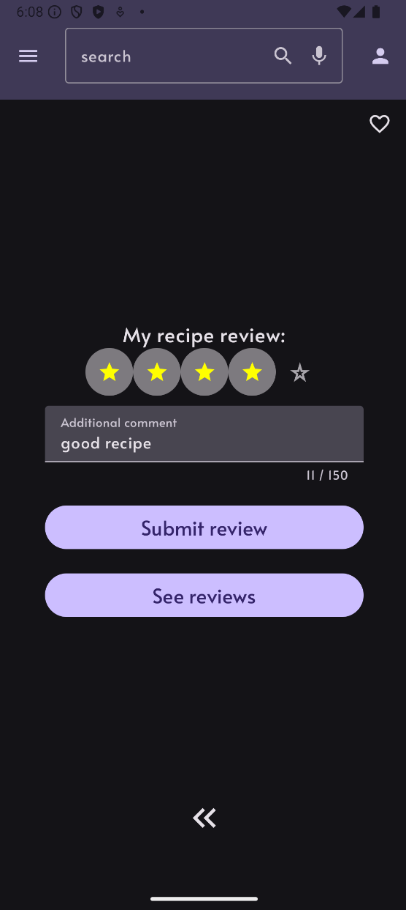
- **Review List Screen**
  
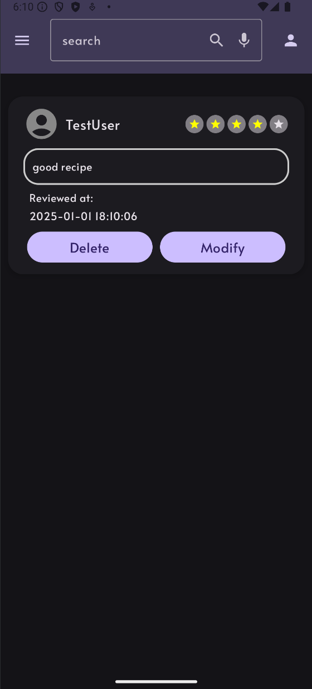

---
## How to use
1. Clone this repository and switch to development branch.
2. Open the project in Android Studio.
3. Ensure the [CookingAssistant API](https://github.com/filip-wojc/CookingAssistantAPI) is running locally or remotely. For local development, update the base URL in the Retrofit configuration.
4. Build and run the app on an emulator or physical device.

---
## Configuration
### 1. Update API Base URL
Edit the `RetrofitClient` configuration:
```kotlin
class RetrofitClient(private val tokenRepository: TokenRepository){
    private val BASE_URL = "http://<your-api-ip>:5080/api/"


    private val loggingInterceptor = HttpLoggingInterceptor().apply {
        level = HttpLoggingInterceptor.Level.BODY
    }
    // Create Bearer Authorization header before sending request
    private val authInterceptor = AuthInterceptor(tokenRepository)

    // configure OkHttpClient for logging, authentication
    private val okHttpClient = OkHttpClient.Builder()
        .addInterceptor(loggingInterceptor)
        .addInterceptor(authInterceptor)

        .connectTimeout(10, TimeUnit.SECONDS)
        .readTimeout(20, TimeUnit.SECONDS)
        .build()


    val retrofit by lazy {
        Retrofit.Builder()
            .baseUrl(BASE_URL)
            .addConverterFactory(GsonConverterFactory.create()) // Use custom Gson
            .client(okHttpClient)
            .build().create(ApiRepository::class.java)
    }
}
```
Replace `<your-api-ip>` with your local IPv4 address or remote server address.

---
## Future Development Plans
1. **Push Notifications**: Notify users about updates, new recipes, and reviews.
2. **Offline Mode**: Enable offline access to saved recipes and reviews.
3. **Multi-language Support**: Add localization for multiple languages.

---
## License
This project is available for use under the MIT License.

---
For any questions, feel free to reach out!

